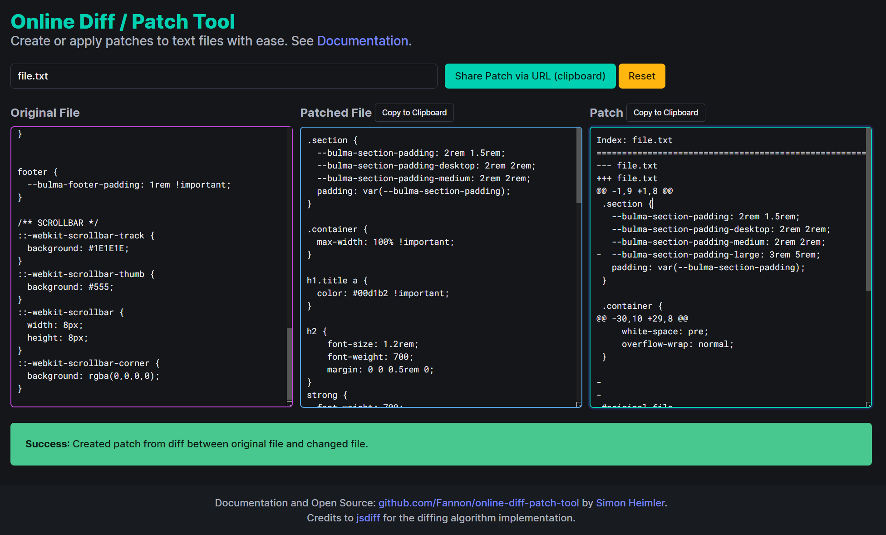

# Online Diff / Patch Tool

## Introduction

This is a very simple web-based tool that can help you:

* Compare the difference between two files and create a patch file 
* Apply a patch to an original file

Patches can also be shared via URL. 
The tool itself does not store or share any data.

> 💡 If you have questions, problems or suggestions, please create a [GitHub issue](https://github.com/Fannon/online-diff-patch-tool/issues).

## Screenshot

## Credits

* [jsdiff](https://github.com/kpdecker/jsdiff#readme) for the diffing algorithm implementation.